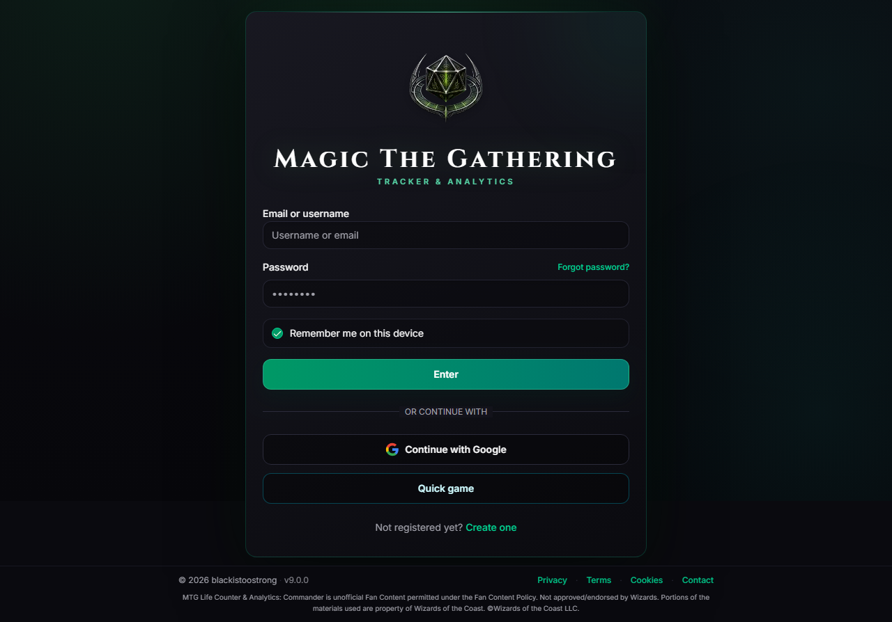
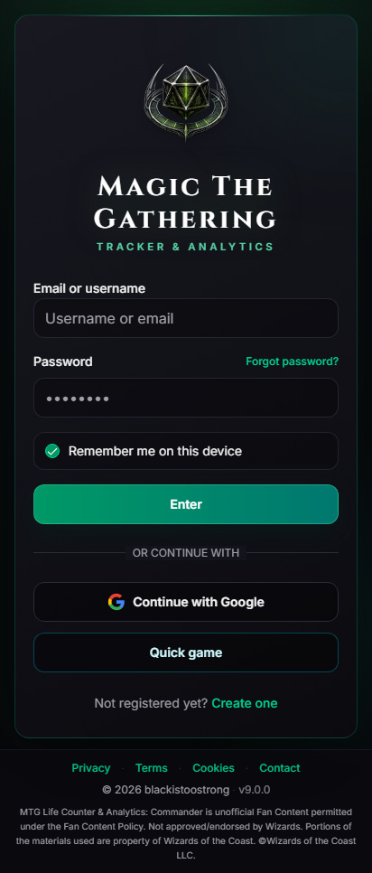

# MTG Tracker & Analytics

Track Commander games, manage your playgroup, and turn match history into useful statistics—without spreadsheets.

Current stable release: **8.1.0**.

## Try or install the app

### Web app

Open [app.phyrexianarena.dpdns.org](https://app.phyrexianarena.dpdns.org) in any modern browser. No installation is required.

### Android with Obtainium

1. Install [Obtainium](https://obtainium.imranr.dev/).
2. In Obtainium, choose **Add App**.
3. Paste this repository URL:

   `https://github.com/marco201091-glitch/PhyrexianArena`

4. Confirm the detected release and install the APK.

Obtainium will notify you when a new signed release is available. You can also download the APK directly from [GitHub Releases](https://github.com/marco201091-glitch/PhyrexianArena/releases/latest).

### F-Droid and iOS

- The official F-Droid submission is currently under review.
- A public iOS build is not available yet.

## Main features

- Live Commander tracker for 2–6 players, with configurable table layouts, life, commander damage, infect, eliminations, undo, and game recovery.
- Private playgroups, invitations, guests, shared match history, and optional public result pages.
- Deck management, paired Commander variants, and imports from Archidekt or Moxfield.
- Rankings, deck and commander performance, color trends, personal analytics, and playgroup awards. Decks with fewer than five recorded games are hidden from rankings by default and can be shown on demand.
- Optional annual Arena seasons, configurable by Arena managers, with summaries of archived seasons.
- Localized notification inbox with an unread counter and notification preferences.
- English and Italian interfaces.
- Email/password authentication and optional Google sign-in in the web and standard Android versions.

## Screenshots

| Desktop | Mobile |
|---|---|
|  |  |

## How it works

The web app and the standard Android app use the same hosted account and data service. Matches, decks, playgroups, and statistics stay synchronized when you sign in on another supported device.

The F-Droid edition keeps the same core tracking and analytics features, but uses email/password authentication and omits Google sign-in, push notifications, avatar upload, and Sentry integration to comply with the F-Droid build policy.

An internet connection is required for account synchronization, multiplayer data, and external deck or card services.

## Privacy and legal information

- [Privacy policy](https://app.phyrexianarena.dpdns.org/legal/privacy)
- [Terms of service](https://app.phyrexianarena.dpdns.org/legal/terms)
- [Account deletion](https://app.phyrexianarena.dpdns.org/legal/delete-account)
- [Third-party notices](THIRD_PARTY_NOTICES.md)
- [MIT License](LICENSE)

MTG Tracker & Analytics is unofficial fan content. It is not approved, endorsed, or sponsored by Wizards of the Coast. Portions of the materials used are property of Wizards of the Coast LLC.
